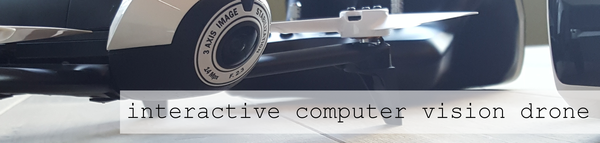

# Computer Vision Drone

## Goal

This is a fun project to build an interactive drone. 

* that has computer vision features
* that has distance sensors
* that has audio in and output

The drone should be able to ...

* navigate inside a room and detect obstacles 
* find persons and detect faces
* interact with persons
  * talk to the person
  * take a picture of the person
  * interact with social media (e.g.) 
  
## Documentation

We are writing a project diary to document our progress and what we have learned.
 
* Jan 2017: [Getting Started - Evaluating Drone Hardware](doc/drone_hardware_evaluation.md)
* Jan 2017: [First Features and Milestones](doc/cv-drone-features-milestone.md)

## Project Team, communication and Dev Environment

### Team

* Tobias Schaber 
* Raphael Manke 
* Michael Plümacher 
* Oli Moser (https://twitter.com/moseroli)

### Communication

* communication via slack channel
* ToDos in trello.com
* sketching diagrams and mindmapping on sketchboard.io
* sources and documentation here on github
* videos on youtube channel

