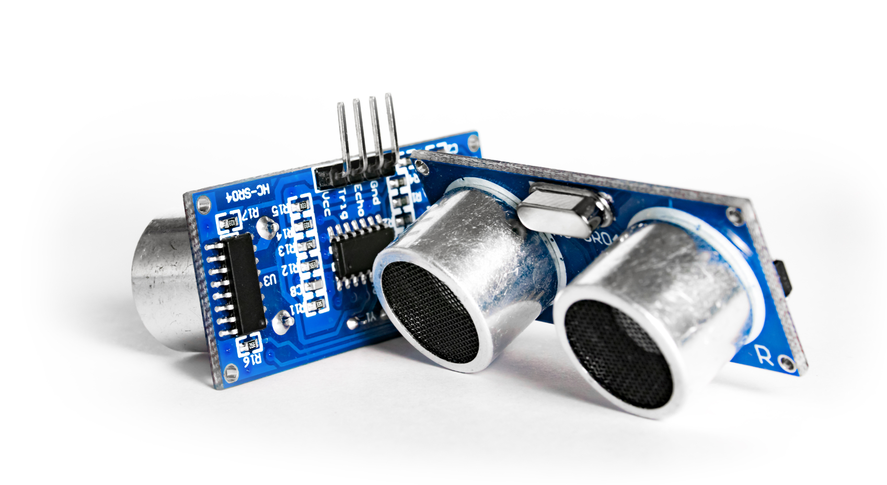
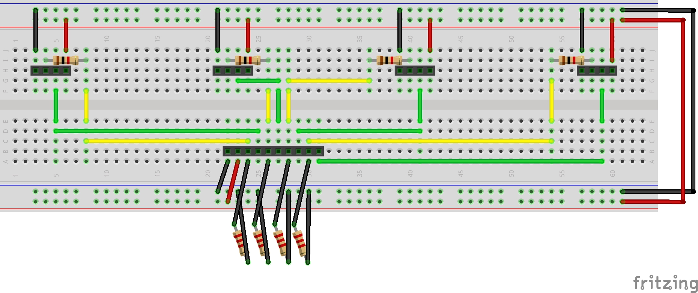

# Basic Research: Perception of the drones surroundings

One of the first work package was to find out how to enable the drone to perceive its surrounding.

## Basic considerations

As our drone shall flight without external control, it will require the ability to perceive its surroundings. 
Even if there are many different ways, we all agreed that the easiest way to achieve that would be to use 
some basic distance sensors on a micro-controller. We already have some experiences with arduino, raspberry 
and such in our team, and this working package was perfectly suitable for parallel work, so we started with
it as one of our first steps.

## Finding a suitable sensor type

We found that there are basically two different groups of sensors which could fit our needs:

- Acoustic sensors (ultrasonic)
- Optical sensors (like infrared or lasers)

They differ significantly in price and capabilities. For example, most infrared sensors are useable for 
small or middle distances (30cm - 150cm). We also found some laser sensors, but their price was always more
than 100€ per unit.
The solution for us was the very cheap HC-SR04 ultrasonic sensor. With a price of less than 3€ per unit, 
a distance range between 2cm and ~300cm and a low weight, it is perfectly suitable for our drone to find out what's upfront.

## The HC-SR04 ultrasonic sensor

No, the HC-SR04 is not the smallest sensor and we might have some trouble mounting it on our drone. But we are 
sure that we get this solved. Here is how the sensor looks like:

The functional principle is easy to explain: The sensor is equipped with a loudspeaker and a microphone. If it 
is triggered, it sends out an acoustic signal and then listens if and when the signal returns and measures this 
delay. The acoustic velocity is approximately known, so the distance is calculable.

## The hardware setup

For our drone, we start with a setup of 4 sensors on a Raspberry Pi. At the beginning we have enough free GPIO pins,
so we start without experimenting on bus systems like SPI or I2C. 

The HC-SR04 has four pins to connect:
- VCC (5V power supply)
- Trigger (incoming signal will start measurement)
- Echo (outgoing signal will provide the result of the measurement)
- Ground

We connected the trigger and echo pins to any free GPIO pins on our Pi, and came to this result:

You can see that we created 4 4-Pin connectors where we can plug in the ultrasonic sensors and one 10-pin connector 
for the connection to the PI. The resistors are needed to bring down the voltage of the echo pin from 5V to 3.3V.

